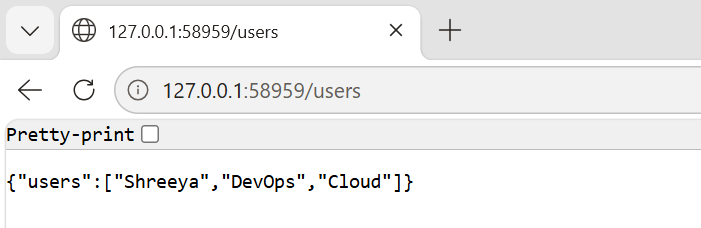

# 🚀 End-to-End CI/CD Pipeline with GitLab and Kubernetes

## 📌 Project Overview
This project demonstrates a complete DevOps pipeline using GitLab CI/CD, Docker, and Kubernetes. The pipeline automates build, testing, and deployment processes with support for staging, production, and rollback.

## 🛠️ Tech Stack
- GitLab CI/CD
- Docker
- Kubernetes (Minikube)
- Python (Flask)
- Linux

## ⚙️ Features
- ✅ CI/CD pipeline with GitLab
- ✅ Dockerized Flask application
- ✅ Automated build and test stages
- ✅ Branch-based deployment:
  - dev → staging
  - prod → production
- ✅ Manual rollback support
- ✅ Kubernetes deployment

## 🔄 Pipeline Flow
Code Push → Build → Test → Deploy → Rollback

## 🧪 Health Check

```bash 
 http://localhost:3000/health
```
## 🚀 How to Run

## Build image
```bash
docker build -t devops-app .


## Run container
```bash
docker run -p 3000:3000 devops-app


## Start Kubernetes
```bash
minikube start

## Deploy app
```bash
kubectl apply -f deployment.yaml
kubectl apply -f service.yaml


## Access app
```bash
minikube service devops-service

---
## 🎯 Output

The application is successfully deployed on Kubernetes and accessible via Minikube service, with CI/CD pipeline ensuring automated build and testing.

## 📸 Project Screenshots

### ✅ Application Running on Kubernetes

---

---

---

- running app ✅  
- pipeline success ✅  

👉 This impresses recruiter instantly 🔥

---


