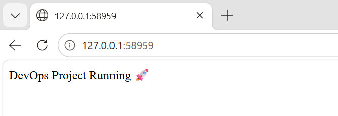
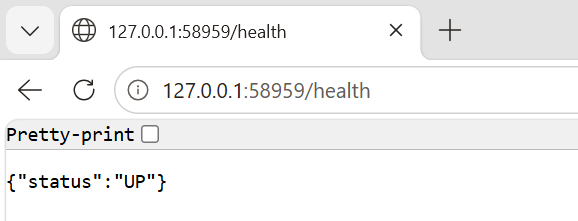
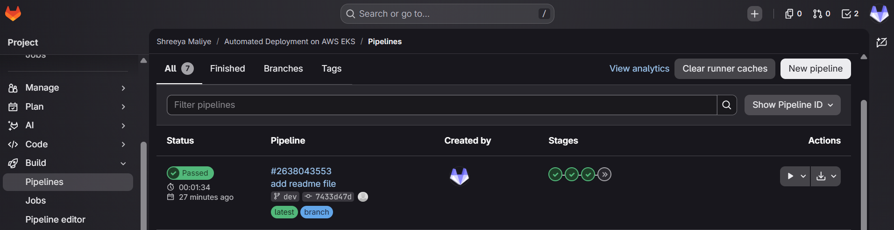
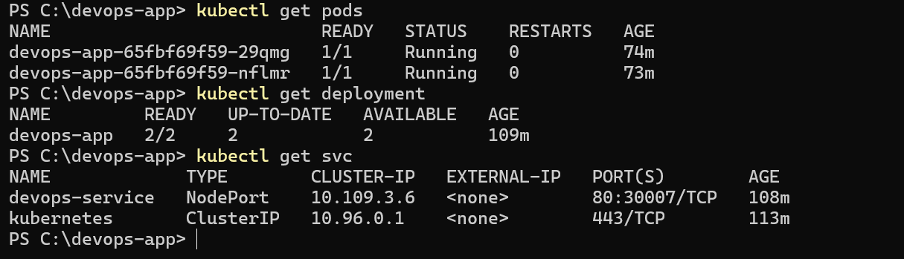
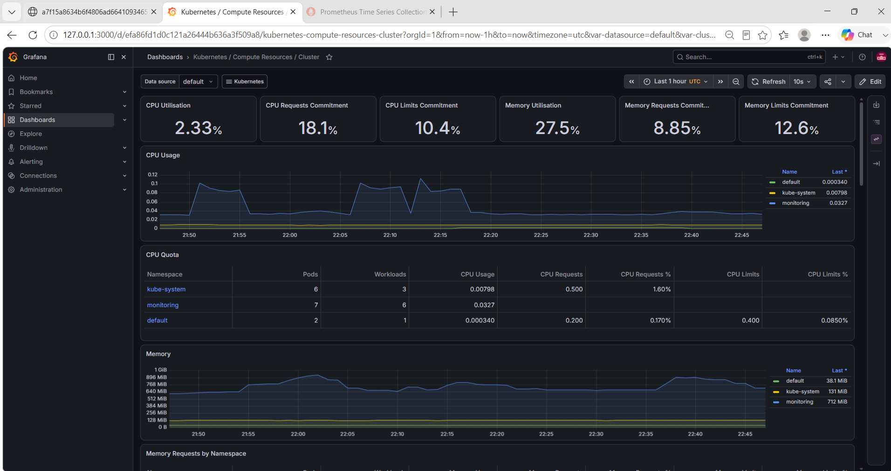
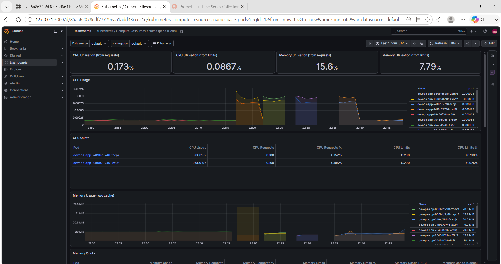
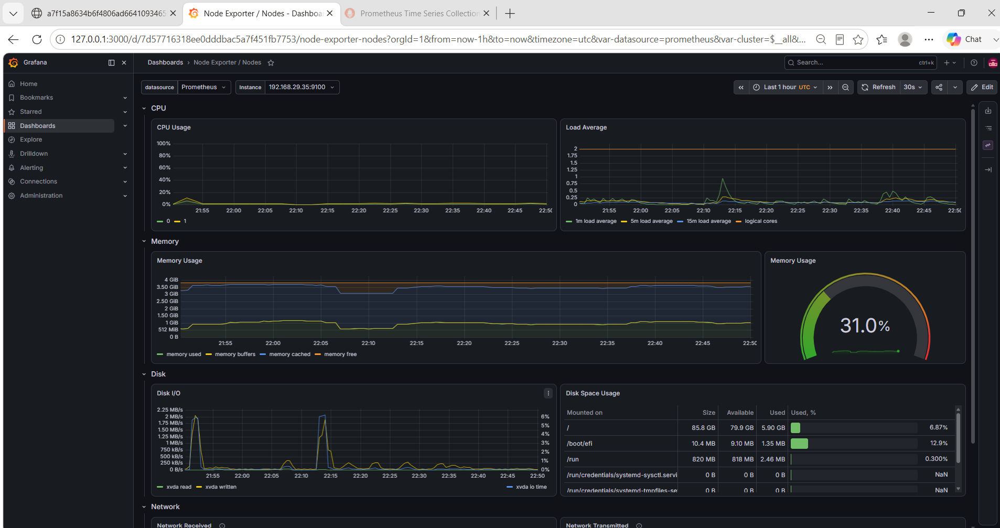
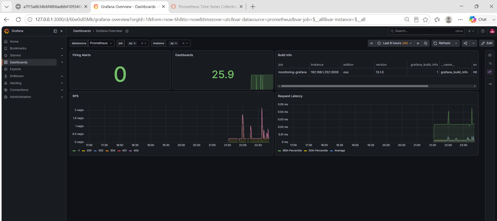
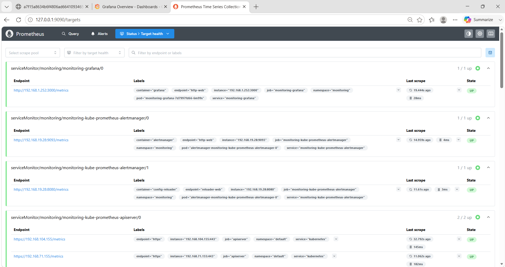

# 🚀 Automated Devops CI/CD Pipeline with GitLab, AWS EKS & Observability

## 📌 Project Overview
This project demonstrates an end-to-end DevOps pipeline with automated build, test, and deployment using GitLab CI/CD. The application is containerized using Docker, deployed on AWS EKS, and monitored using Prometheus and Grafana.

---

## 🛠️ Tech Stack
- GitLab CI/CD
- Docker
- AWS ECR (Elastic Container Registry)
- AWS EKS (Elastic Kubernetes Service)
- Kubernetes
- Prometheus
- Grafana
- Python (Flask)

---

## ⚙️ Features
- ✅ End-to-end CI/CD pipeline using GitLab
- ✅ Dockerized Flask application
- ✅ Automated build and test stages
- ✅ Push Docker images to AWS ECR
- ✅ Deploy application to AWS EKS
- ✅ Public access via AWS LoadBalancer
- ✅ Monitoring with Prometheus and Grafana
- ✅ Resource management using CPU & memory limits
- ✅ Manual rollback support

---

## 🔄 CI/CD Pipeline Flow

Code Push → Build → Test → Push to ECR → Deploy to EKS → Monitor

---

## 🌍 Live Application

The application is deployed on AWS EKS and accessible via LoadBalancer.


http://a7f15a8634b6f4806ad6641093465f21-618352196.us-east-1.elb.amazonaws.com/

---

## 🏗️ Architecture


GitLab → CI/CD Pipeline → Docker → AWS ECR → AWS EKS → LoadBalancer → Prometheus → Grafana

---

## 📊 Monitoring (Prometheus & Grafana)

Implemented monitoring using Prometheus and Grafana for real-time observability.

- Real-time CPU and memory usage tracking
- Kubernetes cluster monitoring
- Pod-level metrics visualization
- Grafana dashboards for insights

---

## 📸 Project Screenshots

### ✅ Application Running on Kubernetes





### ✅ GitLab CI/CD Pipeline Success


### ✅ Deployment & Service Verification

---

### ✅ Kubernetes Cluster Metrics

---

### ✅ Application Pod Metrics

---

### ✅ Node Metrics Dashboard

---

### ✅ Grafana Dashboard

---

### ✅ Prometheus Targets

---

## 🧪 Health Check

http://a9845bf5bf8a244228a83d81365b9db7-242952013.us-east-1.elb.amazonaws.com/health

---

## 🚀 How to Run Locally

### Build Docker image
```bash
docker build -t devops-app .
```

### Run container
```bash
docker run -p 3000:3000 devops-app
```
### Start Minikube
```bash
minikube start
```
### Deploy to Kubernetes
```bash
kubectl apply -f deployment.yaml
kubectl apply -f service.yaml
```

☁️ Deployment on AWS

### Push to ECR
```bash
docker tag devops-app:latest <ECR-URL>
docker push <ECR-URL>
```

### Deploy to EKS
```bash
kubectl apply -f deployment.yaml
kubectl apply -f service.yaml
```

📌 Key Learnings
- Built complete CI/CD workflow using GitLab
- Worked with containerization using Docker
- Deployed real-world app on AWS EKS
- Implemented monitoring using Prometheus & Grafana
- Debugged real production issues (ImagePull, networking, authentication)
- Managed Kubernetes resources and scaling

---

👩‍💻 Author
Shreeya Maliye

---
